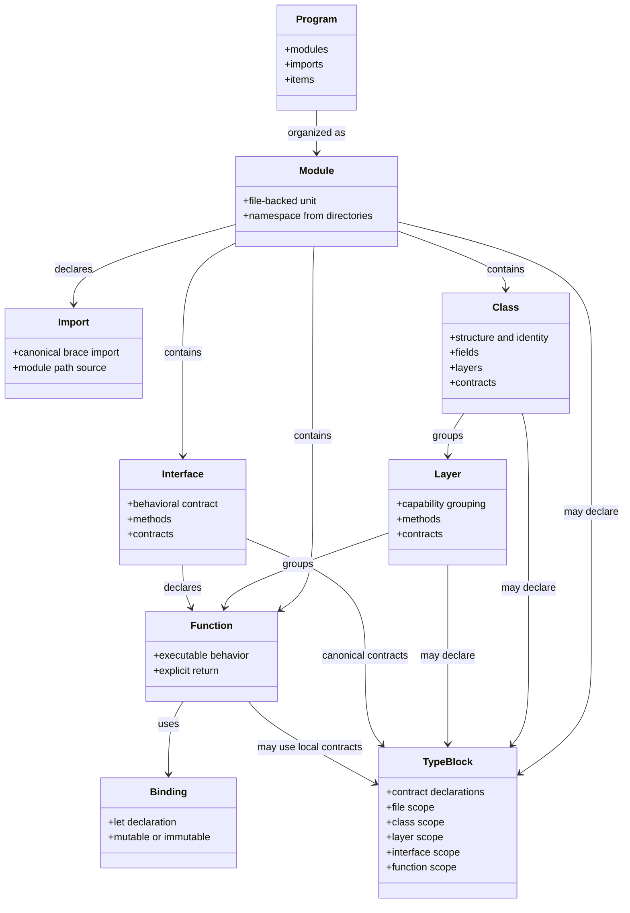
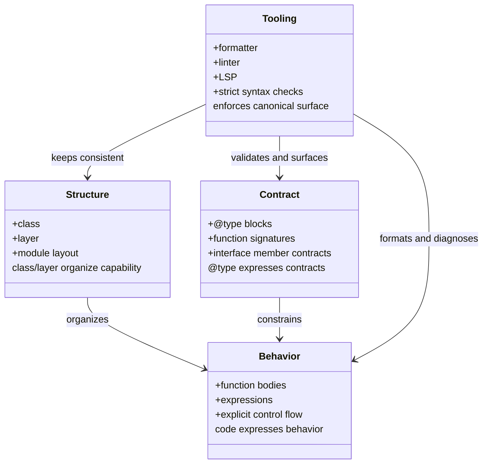
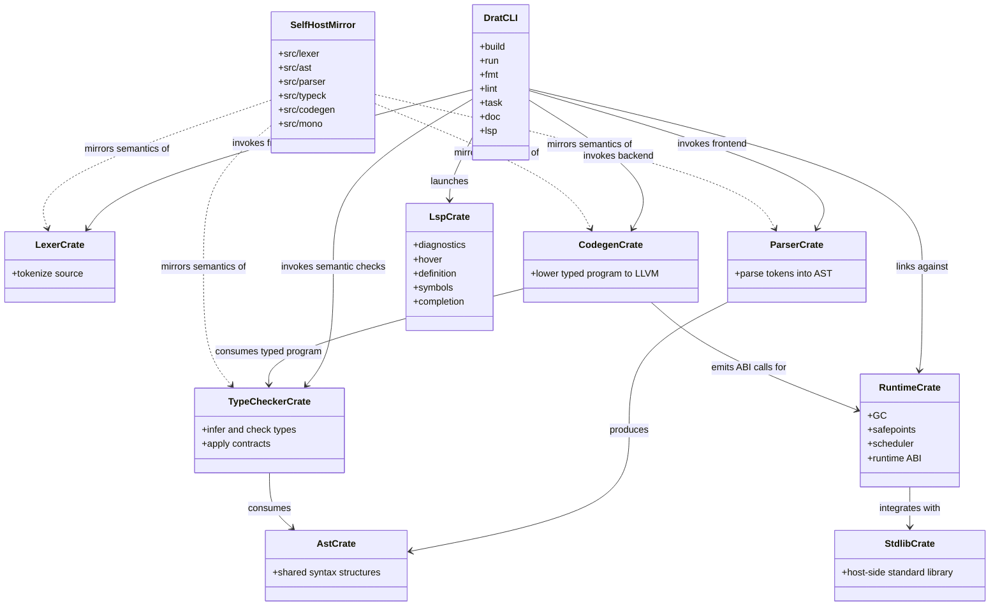

# Draton Class Diagrams

This document provides visual architecture summaries for the Draton language model and the Rust toolchain implementation.

For the full narrative, see [language-architecture.md](language-architecture.md) and [compiler-architecture.md](compiler-architecture.md).

## Language Architecture Diagram

## Language Responsibility Diagram

## Compiler And Toolchain Diagram

## Interpretation Rules

Use these diagrams with the following constraints in mind:

- Rust frontend/tooling remains authoritative.
- The self-host mirror reflects that behavior; it does not define a competing behavior.
- `@type` is a contract layer, not a second executable syntax family.
- `class` and `layer` are structural architecture, not optional style sugar.
- Compatibility syntax should not be read as a second architecture.

## Reading Order

1. [language-manifesto.md](language-manifesto.md)
2. [language-architecture.md](language-architecture.md)
3. [language-class-diagram.md](language-class-diagram.md)
4. [compiler-architecture.md](compiler-architecture.md)
5. [language-analyst-artifact.md](language-analyst-artifact.md)
